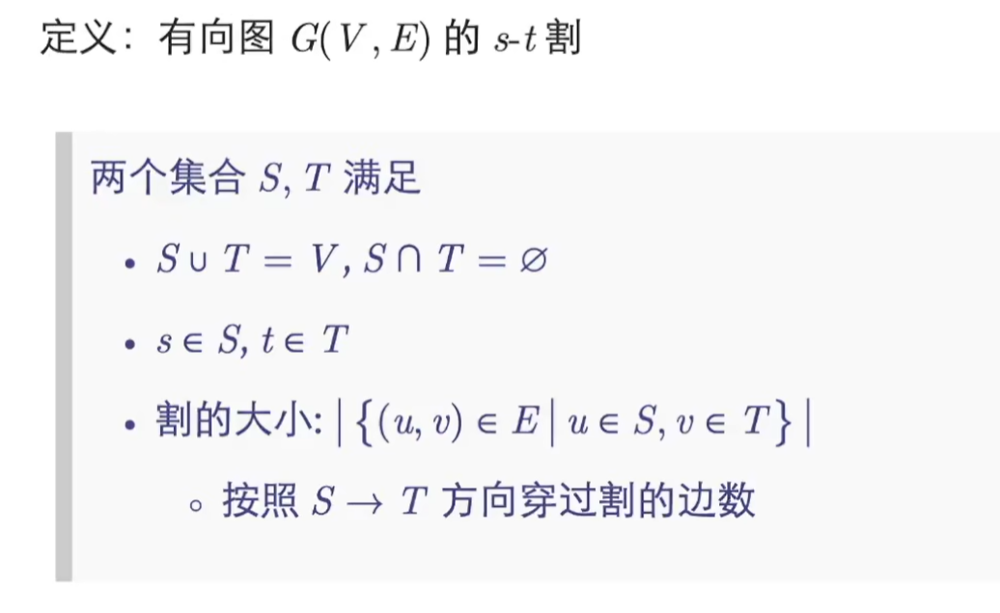
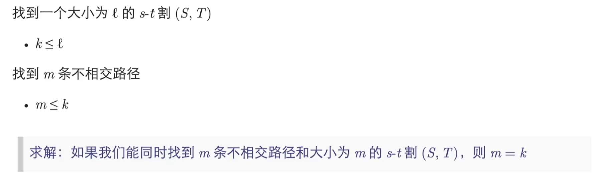
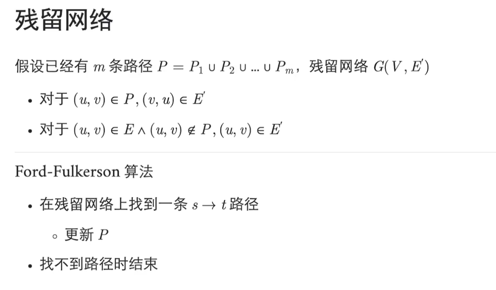

# 最大流

## 流网络

流网络是一个有向图$G$，图中每条边有一个非负的容量值$c(u,v) \ge 0$，而且，如果边集合$E$包含一条边$(u,v)$，则图中不存在反方向的边$(v,u)$。

两个特殊结点：

1. 源结点$s$：以某种稳定的速率生成物料
2. 汇点$t$：以同样的速率消耗物料

流量：物料移动的速率。

假定每个结点都在源结点到汇点的某条路径上。

**流网络满足的性质**：

1. 容量限制：对于所有的结点$u,v∈V$，要求$0 \le f(u,v) \le c(u,v)$；

2. 流量守恒：对于所有的结点$u∈V-${$s,t$}，要求：（流入等于流出）
   $$
   \Sigma_{v∈V}f(v,u)=\Sigma_{v∈V}f(u,v)
   $$

我们定义流$f$的值$|f|$如下：
$$
|f| = \Sigma_{v∈V}f(s,v)-\Sigma_{v∈V}f(v,s)
$$
当出现反向边时，构造辅助点，使用反平行边来模拟问题。

当出现多个源结点或多个汇点时，转换为超级单源结点或超级汇点。

## Ford-Fulkerson方法

具体思想：残存网络、增广路径、切割。

**原理**：循环增加流的值。在开始的时候，对于所有的结点$u，v∈V$，$f(u,v)=0$，给出的初始流值为$0$。每一次迭代中，我们将图$G$的流值进行增加，方法就是在一个关联的残存网络$G_f$中寻找一条增广路径。一旦知道图$G_f$中的一条增广路径的边，就可以很容易辨别出$G$中的一些具体的边，我们可以对这些边上的流量进行修改，从而增加流的值。

残存网络的边：$E_f=${$(u,v)∈V \times V : c_f(u,v) > 0$}

其中$|E_f| \le 2|E|$

其中$c_f(u,v)$称为残存容量：
$$
c_f(u,v) = \left\{
\begin{array}{rcl}
c(u,v) - f(u,v) && 若(u,v)∈E\\
f(v,u) && 若(v,u)∈E \\
0 && 其他
\end{array}
\right.
$$



大小为$0$的$s-t$割是找不到路径的证明。



这里可以构造反向图进行查找不相交路径。



推广到有权重的边：将权重为$n$的边分解成$n$条重边。

网络流问题的原始表达：线性规划

## 最大二分匹配

匈牙利算法：时间复杂度：$O(nm)$

```c++
int n1, n2;     // n1表示第一个集合中的点数，n2表示第二个集合中的点数
int h[N], e[M], ne[M], idx;     // 邻接表存储所有边，匈牙利算法中只会用到从第一个集合指向第二个集合的边，所以这里只用存一个方向的边
int match[N];       // 存储第二个集合中的每个点当前匹配的第一个集合中的点是哪个
bool st[N];     // 表示第二个集合中的每个点是否已经被遍历过

bool find(int x)
{
    for (int i = h[x]; i != -1; i = ne[i])
    {
        int j = e[i];
        if (!st[j])
        {
            st[j] = true;
            if (match[j] == 0 || find(match[j]))
            {
                match[j] = x;
                return true;
            }
        }
    }

    return false;
}

// 求最大匹配数，依次枚举第一个集合中的每个点能否匹配第二个集合中的点
int res = 0;
for (int i = 1; i <= n1; i ++ )
{
    memset(st, false, sizeof st);
    if (find(i)) res ++ ;
}
```

