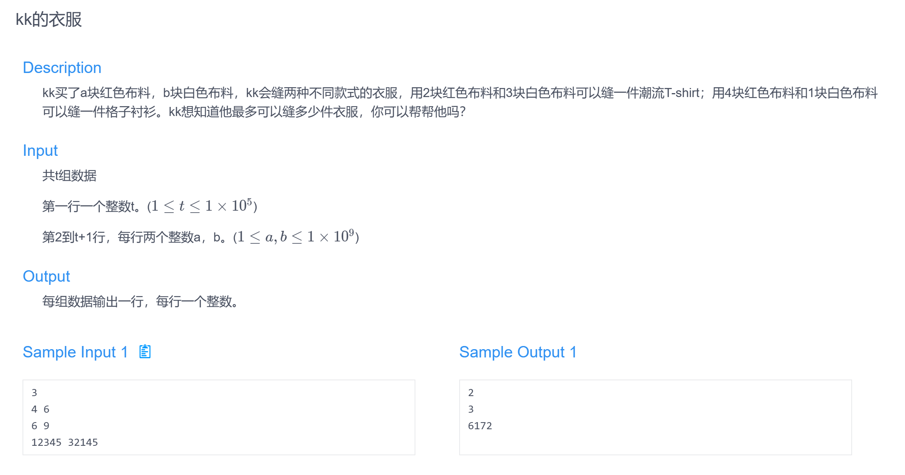

# 线性规划

本章在笔者数学建模这一方面也会有较大的帮助，因此会写得尽量详细。

先从一道题开始引入吧：引自华南师范大学CSOJ寒假训练赛06："春节将过去"的$D$题



这道题很显然是

一个线性规划问题，规划方程如下：
$$
\begin{cases}
2x+4y \le a\\
3x+y \le b\\
\end{cases}
$$
而目标函数为：
$$
max(x+y)
$$
当时还没有系统的学习线性规划，于是直接枚举了三个顶点：

（这里有用到上一章中的高斯消元求解线性方程组）

```c++
#include<iostream>
#include<cmath>
using namespace std;
typedef pair<int, int> PII;
const double eps = 1e-6;
const int N = 3;
int t;
double a, b;
int n = 2;
double f[N][N];
int gauss(void) {
	f[0][0] = 2, f[0][1] = 4, f[0][2] = a;
	f[1][0] = 3, f[1][1] = 1, f[1][2] = b;
	int c, r;
	for (c = 0, r = 0; c < n; ++c) {
		int t = r;
		for (int i = r; i < n; ++i) {
			if (fabs(f[i][c]) > fabs(f[t][c])) {
				t = i;
			}
		}
		if (fabs(f[t][c]) < eps) continue;
		for (int i = c; i <= n; ++i) swap(f[t][i], f[r][i]);
		for (int i = n; i >= c; --i) f[r][i] /= f[r][c];
		for (int i = r + 1; i < n; ++i) {
			if (fabs(f[i][c]) > eps) {
				for (int j = n; j >= c; --j) {
					f[i][j] -= f[r][j] * f[i][c];
				}
			}
		}
		++r;
	}
	if (r < n) return 1;
	for (int i = n - 1; i >= 0; --i) {
		for (int j = i + 1; j < n; ++j) {
			f[i][n] -= f[i][j] * f[j][n];
		}
	}
	return 0;
}
int main(void) {
	cin >> t;
	while (t--) {
		cin >> a >> b;

		if (b >= 3 * a / 2) {
			cout << (int)a / 2 << endl;
		}
		else if (a >= 4 * b) {
			cout << (int)b << endl;
		}
		else {
			gauss();
			int ans = 0;
			int x = f[0][2], y = f[1][2];
			ans = x + y;
			if (2 * (x + 1) + 4 * y <= a && 3 * (x + 1) + y <= b) {
				++ans;
			}
			else if (2 * x + 4 * (y + 1) <= a && 3 * x + y + 1 <= b) {
				++ans;
			}
			cout << (int)ans << endl;
		}

	}
	return 0;
}
```

## 基本概念

1. 约束：对线性规划的约束不等式组
2. 可行解：满足约束条件的解集
3. 目标函数：希望最优化的函数
4. 最优解：可行解中目标函数的最优化解

### 标准型

约束都是不等式。
$$
最大化：\Sigma_{j=1}^nc_jx_j
$$
满足约束条件：
$$
x_j\ge 0(非负约束)\\
\Sigma_{j=1}^na_{ij}x_j\le b_i
$$
我们也可以使用矩阵形式将它们表示出来，这里不再赘述。

### 松弛型

约束都是等式，单纯形算法需要使用这种形式的线性规划。

除了非负约束外，其他约束都是等式。

我们引入变量$s$，使得$s = b_i -\Sigma_{j=1}^na_{ij}x_j$，且$s \ge 0$

我们可以将多个约束都转移成这种形式，即：
$$
x_{i+1} = b_i -\Sigma_{j=1}^na_{ij}x_j
$$
其中所有的$x$变量均有非负约束。

我们用变量$z$来表示目标函数值，这样的导出形式我们称为松弛型。

其中，等式左边的称为基本变量，等式右边的称为非基本变量。

## 单纯形算法

时间复杂度是指数型的，但在实际应用中消耗的时间往往不会太多。

### 转动操作

一个转动选取一个非基本变量（称为替入变量），和一个基本变量（称为替出变量），然后替换二者的角色。

### 本质原理

线性规划一定能在其可行域的顶点处取得目标函数的最值。
